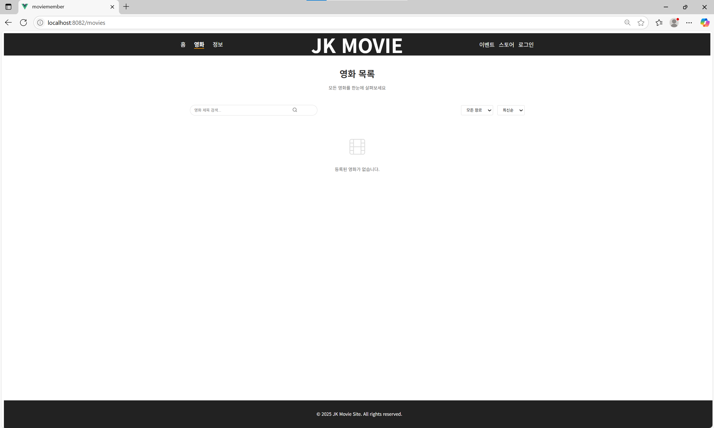

#   Vue3 프론트엔드 프로젝트

##  프로젝트 소개
Vue3 기반 프론트엔드 프로젝트입니다.  
본 프로젝트는 **Vue3 + Vite 기반 Single Page Application**으로,  
Spring Boot 기반 백엔드 **E_SpringBootBackEnd**와 통합되어 동작합니다.  
회원가입, 로그인, 회원탈퇴 등 회원관리 기능 및 영화 목록 조회, 정보 등록(관리자 기능) 등을 수행합니다.

---

##  버전  
1.0V

---

##  프로젝트 개요
- **프로젝트명**: C_VUEProject
- **프레임워크**: Vue3
- **목표**:
  - 사용자 인증 기능(로그인/회원가입/정보수정/회원탈퇴) 구현
  - 페이지별 로그인 정보 공유
  - 이후 영화관 서비스에 필요한 다양한 UI/UX 구성
  - 백엔드(Spring Boot)와 통신하여 실제 데이터를 처리하는 웹 서비스로 확장

---

##  백엔드 연동 주요 기능

| 기능 | 설명 | 연동 API | Vue 페이지 / 컴포넌트 |
|------|------|----------|------------------------|
| **회원가입** | 신규 사용자 등록 | `POST /api/member/signup` | `SignUp.vue` |
| **로그인** | JWT 토큰 발급 & 세션 등록 | `POST /api/member/login` | `Login.vue`, `AuthLayout.vue` |
| **로그아웃** | 토큰 삭제 및 세션 종료 | `POST /api/member/logout` 또는 `DELETE /api/member/session` | `Header.vue` |
| **회원 탈퇴** | 본인 계정 삭제 | `DELETE /api/member/{id}` | `Profile.vue`, `Settings.vue` |
| **회원정보 조회/수정** | 프로필 표시 및 변경 | `GET/PUT /api/member/{id}` | `Profile.vue` |
| **영화 목록 조회** | 전체 영화 리스트 | `GET /api/movies` | `MovieList.vue` |
| **영화 상세조회** | 개별 영화 정보 | `GET /api/movies/{id}` | `MovieDetail.vue` |
| **영화 추천 보기** | 사용자 맞춤 추천 | `GET /api/movies/recommend` | `Recommend.vue` |
| **영화 등록 (관리자)** | 영화 데이터 추가 | `POST /api/movies` | `Admin/MovieForm.vue` |
| **영화 수정/삭제 (관리자)** | 영화 정보 수정/삭제 | `PUT/DELETE /api/movies/{id}` | `Admin/MovieForm.vue` |


---
##  기술 스택

- **프레임워크**: Vue 3 + Vite
- **상태관리**: Pinia   
- **라우팅**: Vue Router  
- **HTTP 통신**: Axios  
- **인증/인가**: JWT 토큰 헤더 저장 및 Interceptor 적용

---
## 실행 방법
- 의존성 설치<br>
npm install
- 개발 서버 실행<br>
npm run serve

---

## 접속
- http://localhost:8082/

- 백엔드(E_SpringBootBackEnd)도 http://localhost:8083/ 에서 실행되어 있어야 정상 동작

---


## 개발자 정보  
이름: 최정규  
이메일: javakyu4030@naver.com

---
## 실행 화면 예시

1. 로그인

2. 회원가입

3. 회원상세조회

4. 홈화면

5. 영화

6. 정보


---

## 수정 및 추가 사항
---

###  1. 아이디 중복(유효성) 검사 기능
회원가입 시, 중복된 아이디를 사전에 확인하여 사용자 경험을 개선하고, 서버 저장 오류를 방지합니다.

---

###  버전  
1.1V

---


###  기능요약  
| 기능           | 설명                                     |
|----------------|------------------------------------------|
| 검사 시점       | 아이디 입력 시 자동 검사 (watch()) 가능 |
| 요청 방식       | Vue에서 axios.post()를 이용한 비동기 요청          |
| 백엔드 API 경로 | POST /api/member/id-check    |
| 응답 포맷       | "ok": 사용 가능, "no": 중복 아이디     |
| 가입 제어       | 중복일 경우 가입 버튼 비활성화 또는 가입 요청 차단 (alert 출력)     |
---

### 실행 화면 예시
1. 아이디 사용 가능

2. 아이디 중복

3. 아이디 중복시 가입 불가


<br>
---

### 2. 관리자 전용 페이지(영화 등록)접근 제어 기능 
관리자 아이디(admin)로 로그인한 경우에만 영화 등록 페이지(/movie/register)에 접근할 수 있도록 구현하였습니다. 일반 사용자는 해당 메뉴 또는 페이지에 접근할 수 없습니다.

---

###  버전  
1.2V

---

### 구현 개요

- 로그인 시 서버에서 로그인한 사용자 ID를 받아와 Pinia 상태에 저장
- 라우터에서 해당 ID가 admin인지 확인하여 접근 권한 제어
- 메뉴 항목에서도 관리자일 때만 '영화 등록' 메뉴 노출

### 핵심 코드

- 관리자 전용 메뉴 조건부 렌더링
```
<!-- Header.vue -->
<template>
  <nav>
    <router-link to="/">홈</router-link>
    <router-link v-if="authStore.userId === 'admin'" to="/movie/register">영화 등록</router-link>
  </nav>
</template>

<script setup>
import { useAuthStore } from '@/stores/auth'
const authStore = useAuthStore()
</script>
```

- 라우터에서 관리자만 접근 가능하게 설정
```
// router/index.js
import { useAuthStore } from '@/stores/auth'

const routes = [
  {
    path: '/movie/register',
    name: 'MovieRegister',
    component: () => import('@/views/MovieRegister.vue'),
    beforeEnter: (to, from, next) => {
      const authStore = useAuthStore()
      if (authStore.userId === 'admin') {
        next()
      } else {
        alert('접근 권한이 없습니다.')
        next('/') // 홈으로 리디렉션
      }
    }
  }
]

```

### 실행 화면 예시
1. 관리자 계정 로그인시 (admin)
